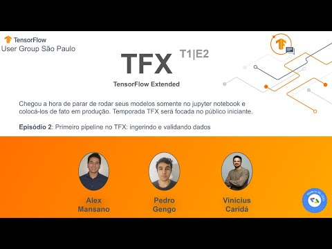

# Tensorflow Extended iniciantes 2022

Repositório destinado ao compartilhamento dos materias e vídeos referentes ao curso de tensorflow extended para iniciantes ministrado em 2022.

- **Episódio 1:** Machine Learning produtivo e introdução a ingestão de dados no TFX

    

- **Episódio 2:** Primeiro pipeline no TFX - ingerindo e validando dados

    
